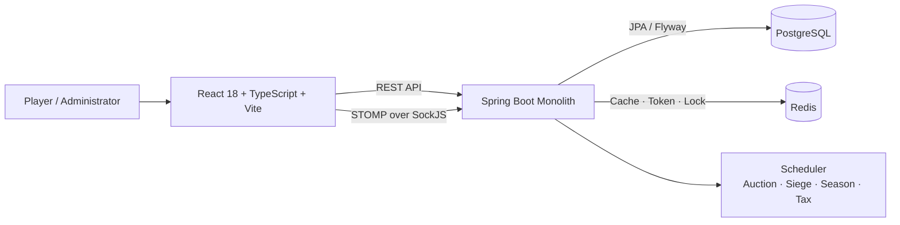

# 픽셀 경매 · 사이버 영토 전쟁

> **내 땅을 건설하고, 키우고, 지키거나 — 빼앗아라.**
> 50×50 월드맵에서 영토를 경매로 획득하고, 건설·자원 생산·공성전으로 성장하는 실시간 전략 웹 게임입니다.

## 프로젝트 개요

| 항목 | 내용 |
|---|---|
| 개발 형태 | 개인 프로젝트 |
| 개발 기간 | 2026.04 – 2026.08 (모놀리식 구현·검증 단계) |
| 핵심 경험 | 실시간 영토 경매, 그리드 건설, 자원 경제, 공성전, 길드·알림 |
| 현재 구조 | Spring Boot 모놀리식 + React SPA |
| 실행 기준 | 로컬 Docker Compose |

## 핵심 기능

| 영역 | 기능 |
|---|---|
| 경매·영토 | 대륙별 영토 탐색, 실시간 입찰, Anti-Sniping, 낙찰·점유 처리 |
| 성장 | 개인 섬·영토 그리드 건설, GP·식량 생산, 금고, 아이템, 시즌 패스 |
| 전투 | Zone 기반 공성, 유닛 생산·주둔, 공격권, 전투 결과·보상 |
| 사회 | 길드, 대륙 채팅, 실시간 알림, 랭킹 |
| 운영 | 관리자 TOTP, 사용자·경매·밸런스 관리, 공지, 감사 로그 |

서비스 규칙과 경제 시스템의 상세는 [기획 개요](docs/planning/overview.md)와 [요구사항](docs/planning/requirements.md)을 참고하세요.

## 아키텍처



- 프론트엔드는 REST와 STOMP/SockJS로 백엔드와 통신합니다.
- 백엔드는 도메인 경계를 패키지로 분리한 모놀리식이며, PostgreSQL·Redis를 사용합니다.
- 향후 MSA 전환은 현재 도메인 경계를 기반으로 검토합니다.

자세한 구조와 도메인 간 의존 규칙은 [아키텍처 설계](backend/.claude/design/architecture.md), [도메인 설계](docs/design/domain-design.md), [WebSocket 문서](docs/api/websocket/README.md)에 정리했습니다.

## 기술 스택

| 구분 | 기술 |
|---|---|
| Frontend | React 18, TypeScript, Vite 6, Tailwind CSS 4 |
| Backend | Java 17, Spring Boot 3.4, Spring Data JPA, Spring Security |
| Realtime | STOMP, SockJS, Spring WebSocket |
| Data | PostgreSQL, Redis, Flyway |
| Test | JUnit, Mockito, Vitest, React Testing Library, Gatling |
| Local Infra | Docker Compose, Nginx |

## 빠른 시작

실제 실행 기준은 로컬 Docker Compose입니다.

```bash
cp backend/.env.production.example backend/.env.production
# .env.production의 JWT_SECRET과 DB 비밀번호를 안전한 값으로 변경
docker compose -f docker-compose.production.yml up -d --build
```

- 사용자 화면: `http://localhost:3000`
- API health: `http://localhost:8080/actuator/health`

개별 개발 서버를 실행하거나 관리자 초기화·백업·복구를 수행하려면 [로컬 운영 실행 가이드](docs/operations/local-production.md)를 따르세요.

## 검증

- Backend: `./gradlew spotlessCheck test gatlingClasses`
- Frontend: `npm run test:run`, `npm run build`
- 로컬 Docker 사용자·관리자 수동 흐름 확인
- 우선순위 혼합 Soak: 50 VU, 1시간, 71,665 요청, 실패 0건
- Render·Supabase·Upstash 외부 호환성 스모크 완료

전체 기준과 알려진 제한은 [v1.0.0 모놀리식 릴리스 기준점](docs/releases/v1.0.0-monolith.md), 현재 구현 현황은 [체크리스트](docs/checklist.md)에서 확인할 수 있습니다.

> Render Free는 512MB 메모리 한도로 현재 모놀리식의 지속 실행 환경에 적합하지 않습니다. 외부 설정은 호환성 재현용으로만 보관하며, 상시 실행은 로컬 Docker Compose를 사용합니다. 자세한 내용은 [외부 호환성 검증 가이드](docs/operations/external-render-supabase.md)를 참고하세요.

## 가이드와 문서

| 대상 | 문서 |
|---|---|
| 플레이어 | [인터랙티브 사용자 가이드](https://claude.ai/code/artifact/366effa3-8970-4353-a97c-aa4a4fabe49f?via=auto_preview) · [텍스트 사용자 가이드](docs/guides/user-guide.md) |
| 관리자 | [관리자 운영 가이드](docs/guides/admin-guide.md) · [관리자 API](docs/api/admin.md) |
| 개발자 | [문서 인덱스](docs/README.md) · [API 공통 규칙](docs/api/README.md) · [코드 컨벤션](docs/design/code-conventions.md) |
| 운영 | [로컬 운영](docs/operations/local-production.md) · [외부 호환성 검증](docs/operations/external-render-supabase.md) |

## 개발 흐름

`feature/* → dev → main` 흐름을 사용합니다.

- `dev`: 로컬 개발 통합 브랜치
- `main`: 릴리스·외부 호환성 설정 기준 브랜치
- `main`의 배포 설정은 자동 실행하지 않습니다.

세부 Git 규칙은 [.claude/rules/git.md](.claude/rules/git.md)를 참고하세요.

## License

This project is licensed under the [MIT License](LICENSE).
